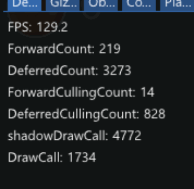
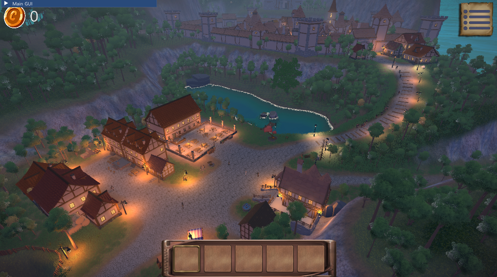

# Catch & Cook

  

C++ 20과 DirectX 12 기반의 프레임워크 및 렌더링 파이프라인을 설계·구축하여 개발된 3인칭 게임 프로젝트.  

English

The third-person game project developed by designing and building a C++20 and DirectX 12–based framework and rendering pipeline.

  

 

  

More

  
  
  

  

### 개발 목적
 - C++20과 DirectX 12를 활용해 렌더링 파이프라인 프레임워크를 직접 설계·구축하고, 이를 기반으로 플레이 가능한 3인칭 게임을 개발하기 위함  
 - 이 과정을 통해 그래픽스 및 코어 엔진 엔지니어링에 대한 이해를 심화하기 위함  

English

 - To design and implement a rendering‑pipeline framework using C++20 and DirectX 12, and develop a playable third‑person game based on it  
 - To deepen my understanding of graphics and core‑engine engineering through this process  

  

### 사용 기술 & 서드파티
 - C++ 20 (*MSVC*)  
 - DirectX12  
 - [ImGUI](https://github.com/ocornut/imgui)  
 - [Assimp](https://github.com/assimp/assimp)  
 - [FMOD](https://www.fmod.com)  
 - Unity ( *Level Design Tools* )  
   - [Asset Store](https://assetstore.unity.com/packages/tools/utilities/scene-object-json-exporter-322005)

### 개발 기간
 - **8개월 (2025.01.15 ~ 2025.07.28)**  

### 팀원 / 역할 분담
| 이름                        | 역할               |
|----------------------------|----------------------|
| **진현서 / Jin Hyeon Seo (Clrain)** | [클라이언트 – 육지 파트 ( *Client – Land Content* )](#jin) |
| **김상혁 / Kim Sang Hyuk**          | [클라이언트 – 해상 파트 ( *Client – Maritime Content* )](#kim) | 

**(DirectX12의 기반 렌더링 및 로직 파이프라인 전반의 대부분을 공동으로 상의하며 함께 설계함.)**

### 게임 개요  
   - 육지와 해상이 나뉘어진 공간에서 플레이
   - 낮에는 식당을 경영하기 위하여 직접 해상에서 재료들을 수급하고, 밤에는 손님들에게 음식을 제공하여 돈을 버는 방식
   - 성장형 경영 타이쿤 게임.  

English

 - Set in an environment split between land and sea  
 - During the day, you source ingredients directly from the sea to run your restaurant; at night, you serve food to customers to earn money  
 - A growth‑oriented management tycoon game  

  

줄거리

   - 망망대해 위에 어느 한 섬. 희귀한 광물 **미스라이트**가 풍부한 것으로 알려진 이 섬에는 무역상인들을 중심으로 한 모험가와 귀족상단이 주둔하여 광물을 채집하고 무역을 하고 있었다. 사람은 모여있고, 돈은 많고, 먹을 것은 부족한 이 섬에서 주인공은 식장을 개업하기로 하는데...  

  

    

# Project Overview  
**Youtube - Devlog**  
 - [[Devlog] DirectX12 - Post Processing](https://youtu.be/-TeBrZH87XQ)  
 - [[Devlog] DirectX12 - Character NPR Toon Shader](https://youtu.be/TLnCw8tBEnE)  
 - [[Devlog] DirectX12 - Cascade Shadow Mapping](https://youtu.be/0_6SBgFWlvk)  
 - [[Devlog] DirectX12 - Stylized Water Shader](https://youtu.be/ExiXoHy73so)  
 - [[Devlog] DirectX12 - Collision & PathFinding](https://youtu.be/xzuFgoVAOT0)  
 - [[Devlog] DirectX12 - Skinned Mesh Animation](https://youtu.be/XBQ563GVM80)  

### 맵소개
#### 인트로 / Intro
  

#### 식당 / Restaurant
  

#### 성 마을 / Fortified Village
  

#### 신비한 연못 / Mysterious Pond
  

#### 중앙 마을 / Middle Village
  

#### 부둣가 / Dockside
  

#### 바닷속 / UnderWater
  

* * *  
    

# Technical Overview

## Pipeline Flow
  

### Render Pass Flow
  

* * *  
    

## Technologies Used

### Skinned Mesh Rendering
  

### NavMesh & PathFinding  
[[ YouTube ] DirectX12 - Collision & PathFinding](https://youtu.be/xzuFgoVAOT0)  
  
  

### Collision
  

### Frustum Culling
  
  

### Static & Dynamic GPU Instancing  
> Object Count
> **(5000 objects, 30000 trees, 100,000 grass)**  

  

### Cascade Shadow Mapping (CSM)  
**4‑Cascade LOD**
[[ YouTube ] DirectX12 - Cascade Shadow Mapping](https://youtu.be/0_6SBgFWlvk)  
  
  

### Terrain Tessellation  
  
  

### Deferred Rendering (Lots of Additional Light)   
  

### Post Processing  
#### Final Visualization
[[ YouTube ] DirectX12 - Post Processing](https://youtu.be/-TeBrZH87XQ)  
  
  

#### Screen Space Ambient Occlusion (SSAO)  
  

### Time of Day
  

### Stylized Water Shader
[[ YouTube ] DirectX12 - Stylized Water Shader](https://youtu.be/ExiXoHy73so) 
  

### Character Non-Photo Realistic (NPR) based Shading
[[ YouTube ] DirectX12 - Character NPR Toon Shader](https://youtu.be/TLnCw8tBEnE)  
#### SDF Face Shadow
  

#### Subsurface scattering (SSS)
  

#### Sobel Filter based Outline & Specular
  

**(+Rim Light, Simple GI)**
### Seawater Visualization & Waves
  

### Unity-based Level-Design(*Scene*) Loader

  

#### Scene&Object Json Exporter  
**The project’s functionality was modularized and released as an asset.**  
[Click to visit the Asset Store](https://assetstore.unity.com/packages/tools/utilities/scene-object-json-exporter-322005)  

  

* * *  
    

## Development Tasks
#### 공동 개발

  
  
상세 개발 내용
 

- **Overall DirectX 12 setup and development**
- Render Pass Policy
- Vertex, Material, Shader, Pipeline Policy
- Mesh Rendering Flow
- Root Signature
- Light Logic
- Dynamic Instancing & Batching
- Frustum Culling
- Mesh‑based Pass System
- Scene System, Scene Manager

  

#### 진현서 / Jin Hyeon Seo (Clrain)

  
  
상세 개발 내용
  

**Content**
 - 육지 컨텐츠 전담 개발 
 - 메인 메뉴, 팝업 메뉴, InGame GUI

**Core Systems**
 - GameObject, Component, GUID‑based Object‑Control System
 - Transform Hierarchy System
 - Collider Raycasting System
 - Unity based level Scene Loader
 - Model Resource Loader
 - NavMesh based ASter(+Funnel) PathFinding
 - UI - Sprite Rect Transform based GUI System
 - Debug - Gizmo
 - Debug - Performance Profiler 
 - Finite state machine(FSM) based NPC System
 - Shader Compiler, Profiler
 - Terrain Static Instancing (*tree, grass*)

**Rendering**  
 - Geometry‑based Gizmo Rendering
 - Forward (*+Transparent*) Rendering
 - Resource Dynamic Matching&Linking System
 - Pipeline State Object (PSO) Policy
 - Skinned Mesh, Animation System
 - Deferred Environment Visual Shading
 - Character NPR based Shading
   - SDF Face Shadow
   - Sobel Filter based Outline, Specular
   - Subsurface scattering (SSS)
   - Rim
   - Ramp Texture based shading
 - Cascade Shadow Mapping (CSM)
 - Stylized Water Shader
 - Post Processing (Compute Shader)
   - Depth of Field
   - Bloom, Blur (*Optimization*)
   - God Ray
   - Time of Day
   - Screen Space Ambient Occlusion (SSAO)
   - Fast approximate Anti-Aliasing (FXAA)
   - Color Grading
   - Vignette

  

#### 김상혁 / Kim Sang Hyuk

  
  
상세 개발 내용
  

**Content**
 - 해상 컨텐츠 전담 개발
 - All Particle Effects Contant (*폭죽, 연기, 물안개, 불 등등*)
 - 육지 - Boat Controller
 - 육지 - Sea Water Visual, Movement

**Core Systems**
 - Call based Collision Division Space
 - Path Trail Mover System
 - UI - Text, Texture Rendering System
 - Buffer Pool, Manager
 - Resource Manager
 - Debug - IMGUI System Link
 - Sound System
 - Texture Loader System
 - Render Texture System
 - Boids Algorithm based Swarm Control

**Rendering**  
 - DirectX Default Initialization
 - Deferred Rendering
 - Terrain Tessellation
 - Compute Shader Pipeline
 - Nested Frame Rendering
 - Underwater Visual Shading & Effects
   - Phong‑based Rendering
   - Rim
 - 육지 - Sea Water Shader, Wave Movement
 - Geometry, Stream-Output based Particle System
 - Post Processing (Compute Shader)
   - Blur
   - Bloom
   - Fog Factor
   - Depth Capture
   - Under Water Post Effect
   - 	Dissolve (*Fade‑In/Out*)
   - Scattering

  

* * *  

Middle Present Execute : https://drive.google.com/file/d/1GvVb6xl6p1NtAi3A1yd_0g4KXDfFq1Eu/view?usp=drive_link
Last Present Execute : https://drive.google.com/file/d/1mJVY8-xbjTHjggJgFJks5_SR9z3ktg3_/view?usp=sharing