# CatchAndCook 로직/렌더링 분석

## 분석 범위

이 문서는 `./CatchAndCook` 폴더의 실제 C++ 코드 기준으로 다음을 정리한다.

- 실행 진입점과 프레임 루프
- `Scene` 중심의 업데이트/렌더 스케줄링
- DX12 렌더 타깃, GBuffer, ShadowBuffer, 후처리 compute 파이프라인
- `SceneLoader` 기반 JSON 씬 복원 구조
- 메인 필드, 바다 씬, 플레이어/보트/잠수/사냥/요리/NPC/UI 흐름
- 코드에서 확인되는 최적화 테크닉

주요 기준 파일:

- `CatchAndCook/main.cpp:14`
- `CatchAndCook/Game.cpp:41`, `CatchAndCook/Game.cpp:200`
- `CatchAndCook/Core.cpp:31`, `CatchAndCook/Core.cpp:73`, `CatchAndCook/Core.cpp:85`
- `CatchAndCook/Scene.cpp:62`, `CatchAndCook/Scene.cpp:103`, `CatchAndCook/Scene.cpp:116`
- `CatchAndCook/Scene_Sea01.cpp:34`, `CatchAndCook/Scene_Sea01.cpp:271`
- `CatchAndCook/SceneLoader.cpp:25`, `CatchAndCook/SceneLoader.cpp:235`, `CatchAndCook/SceneLoader.cpp:269`, `CatchAndCook/SceneLoader.cpp:832`

---

## 1. 런타임 진입과 프레임 루프

핵심 특징은 `main -> Game -> Scene -> Core` 순서로 책임이 내려가는 구조라는 점이다.

- `main.cpp`는 Win32 윈도우를 만들고 메시지 루프를 돌리며, 메시지가 없을 때마다 `game->Run()`을 호출한다.
- `Game::Init()`은 거의 모든 전역 싱글톤 매니저를 올린다.
  - `Core`, `Time`, `Input`, `ResourceManager`, `NavMeshManager`, `SceneManager`, `ColliderManager`, `CameraManager`, `LightManager`, `ShadowManager`, `ComputeManager`, `ParticleManager`, `Sound`, `InGameGlobal` 등
- `Game::Run()`은 프레임 단위 orchestration 함수다.
  - 입력/시간/사운드 업데이트
  - 게임 전역 입력 처리(`Esc`, `F9`, 종료 처리)
  - 카메라 갱신
  - 커맨드리스트 리셋
  - 현재 씬 로직 업데이트
  - 렌더 패스 실행
  - Present
  - 파괴 큐 정리

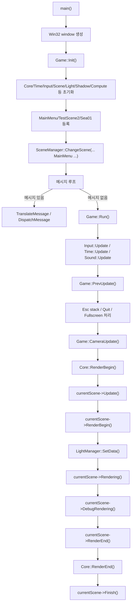

### 프레임 루프에서 실제로 눈에 띄는 구조적 특징

- `Game`은 렌더러가 아니라 "프레임 스케줄러" 역할이다.
- `Scene`은 로직 관리자이면서 동시에 패스 그래프의 driver다.
- `Core`는 DX12 command list / swapchain / present 책임만 가진다.
- 따라서 "게임 로직 flow"와 "렌더링 flow"가 `Scene`에서 다시 합쳐진다.

---

## 2. 씬 기반 객체 수명주기

### 2.1 GameObject / Component 생명주기

`Scene`, `GameObject`, `Component`의 관계는 Unity 비슷한 형태지만 실제 구현은 더 직접적이다.

- `Scene::CreateGameObject()`가 `GameObject`를 생성하고 즉시 `Init()` 호출
- `GameObject::AddComponent<T>()`가 컴포넌트를 생성하고 owner를 연결한 뒤 `Init()` 호출
- `Scene::_startQueue`에 owner를 넣고, 다음 `Scene::Update()` 프레임에서 `GameObject::Start()` 실행
- `GameObject::Start()`는 `_first` 플래그가 켜진 컴포넌트만 한 번만 시작
- `Update`, `Update2`, `RenderBegin`, `RenderEnd`는 모든 활성 컴포넌트에 순차 호출
- `Destroy`는 즉시 삭제가 아니라 queue 기반 지연 파괴

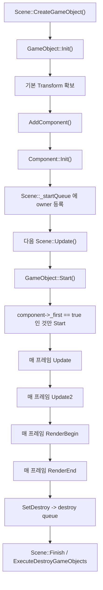

### 2.2 Scene이 하는 일

`Scene`은 아래 4단계를 책임진다.

1. 업데이트 전 준비
2. 오브젝트/컴포넌트 업데이트
3. 렌더 패스 수집과 실행
4. 파괴/씬 전환 마무리

업데이트 단계는 `Scene.cpp:62`의 `Update()`에서 다음 순서로 진행된다.

- 타입 변경 큐 처리
- 시작 큐 처리
- 동적 오브젝트 `Update()`
- 동적 오브젝트 `Update2()`
- `ColliderManager::Update()`

---

## 3. 렌더링 파이프라인 개요

이 프로젝트의 렌더링은 "렌더러 컴포넌트가 Draw를 바로 때리는 방식"이 아니라:

1. 각 렌더러가 `RenderBegin()`에서 자신을 패스 큐에 등록
2. `Scene`이 패스 단위로 `_passObjects`를 순회
3. `InstancingManager`가 배칭/structured buffer 바인딩
4. 실제 `MeshRenderer::Rendering()` 또는 `SkinnedMeshRenderer::Rendering()`이 draw

이 흐름으로 되어 있다.

### 3.1 패스 수집 단계

- `MeshRenderer::RenderBegin()`과 `SkinnedMeshRenderer::RenderBegin()`이 현재 메시/머티리얼 조합을 `Scene::AddRenderer()`로 등록한다.
- 머티리얼의 `RENDER_PASS::PASS` 플래그가 여러 개면 여러 패스에 동시에 들어갈 수 있다.
- 예:
  - 본 렌더 머티리얼
  - depth-normal prepass clone
  - shadow caster clone

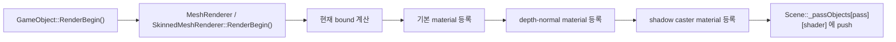

### 3.2 메인 필드/메인 메뉴 렌더 플로우

기본 `Scene::Rendering()` 흐름은 다음과 같다.

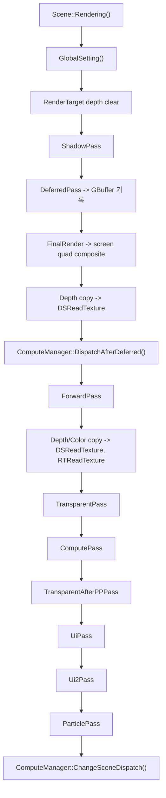

실제 의미는 이렇다.

- `ShadowPass`
  - 4단 캐스케이드 그림자맵 생성
- `DeferredPass`
  - Position / Normal / Color / MAO 4개 RT에 기록
- `FinalRender`
  - GBuffer를 기반으로 fullscreen quad composite
- `DispatchAfterDeferred`
  - SSAO 같은 "deferred 직후" 효과
- `ForwardPass`
  - 순수 forward 렌더 대상
- `TransparentPass`
  - 카메라 기준 정렬 후 투명 오브젝트 렌더
- `ComputePass`
  - 씬별 후처리
- `UiPass`, `Ui2Pass`
  - 일반 UI와 overlay 성격 UI를 분리
- `ParticlePass`
  - compute + point rendering 기반 파티클

### 3.3 바다 씬(`Scene_Sea01`) 렌더 플로우

바다 씬은 기본 씬 파이프라인을 그대로 쓰지 않고 일부를 override 한다.

- `DispatchAfterDeferred()`를 생략한다.
- `TransparentPass()`는 사실상 비활성이다.
- 대신 `NoEffectPass()`를 따로 둔다.
- `ComputePass()`는 메인 필드용 post FX가 아니라 수중용 effect 체인을 사용한다.

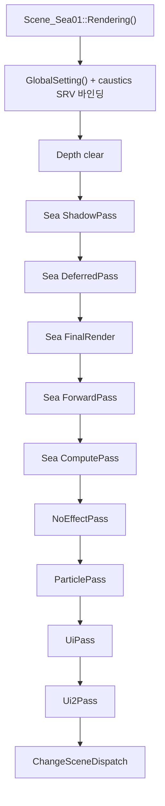

바다 씬이 별도 파이프라인을 가진 이유는 코드상 다음 차이와 연결된다.

- 물/카우스틱/수중 안개/산란(scattering) 효과 우선
- 메인 필드의 bloom/fxaa/dof/vignette 위주 체인과 목적이 다름
- 바다용 오브젝트는 `SceneLoader`에서 해저 셰이더 세트로 바꿔치기된다

---

## 4. 렌더 타깃, 섀도우, 후처리의 실제 구조

### 4.1 RenderTarget / GBuffer / ShadowBuffer

`RenderTarget.cpp` 기준으로 렌더링 버퍼 구성은 다음과 같다.

- Swapchain backbuffer
  - `RenderTarget::_RenderTargets[SWAP_CHAIN_FRAME_COUNT]`
- Main depth
  - `_DSTexture`
- GBuffer 4장
  - `[0] Position`
  - `[1] Normal`
  - `[2] Color`
  - `[3] MAO`
- Shadow depth 4장
  - `_DSTextures[4]`
- Post process용 ping/pong
  - `ComputeManager::_pingTexture`, `_pongTexture`
- 읽기 전용 copy
  - `Core::_dsReadTexture`, `Core::_rtReadTexture`

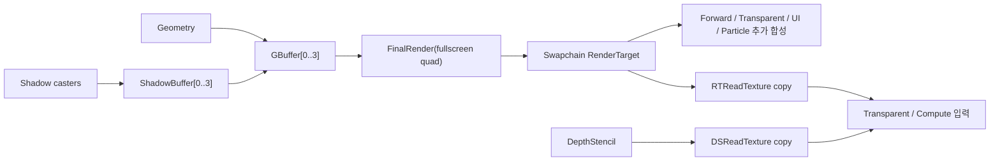

### 4.2 Shadow 구조

`ShadowManager`는 4캐스케이드 CSM(cascaded shadow map)을 사용한다.

- 일반 씬: `CalculateBounds(... {6, 20, 65, 200})`
- 바다 씬: `SeaCalculateBounds(... {500, 1000, 2000, 3000})`

즉, 씬마다 cascade 분할 거리가 다르다.

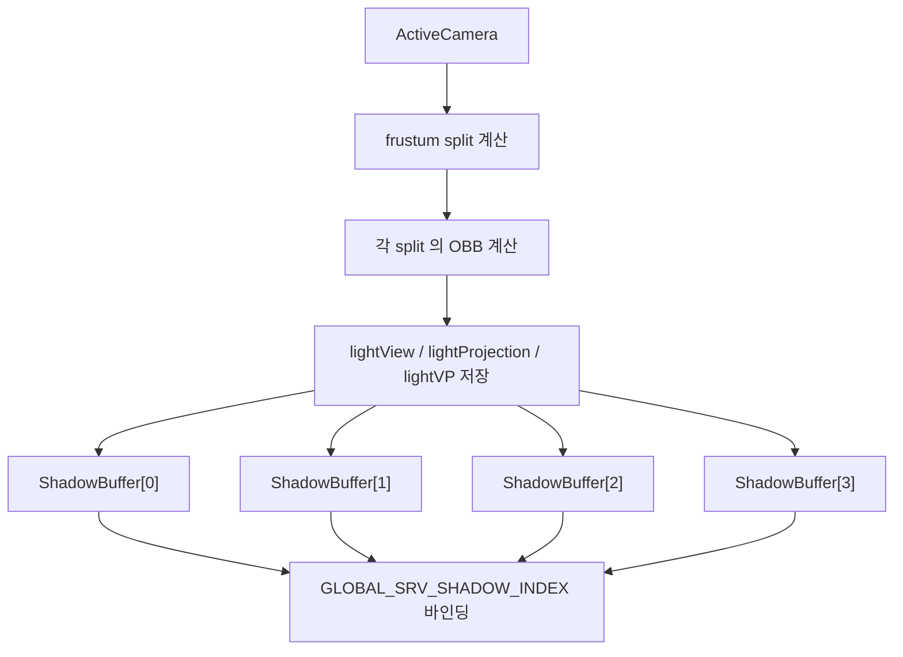

### 4.3 ComputeManager 역할 분리

`ComputeManager`는 하나지만 실제로는 두 종류의 체인을 운영한다.

#### 메인 필드/메인 메뉴 체인

- DepthRender
- FieldFogRender
- Blur
- Bloom
- GodRay
- FXAA
- DOF
- ColorGrading
- Vignette

#### 바다 체인

- DepthRender
- UnderWaterEffect
- Scattering
- ChangeScene fade

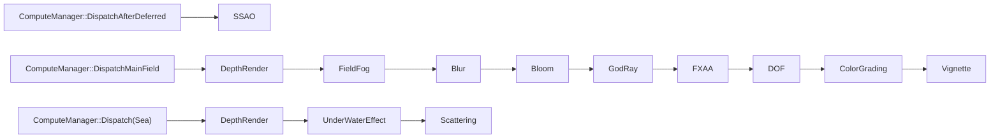

---

## 5. 리소스 바인딩과 드로우콜 생성 구조

### 5.1 SceneLoader와 런타임 코드의 역할 분담

이 프로젝트는 "씬 파일로 배치된 정적 구조"와 "C++가 씬 로드 뒤 붙이는 동적 로직"이 분리되어 있다.

`SceneLoader`는:

- JSON을 읽고 GUID 기준으로 GameObject/Component/Material을 선생성
- 모델/텍스처를 선로드
- `LinkMaterial -> LinkComponent -> LinkGameObject` 순으로 연결

씬 클래스(`MainMenuScene`, `TestScene_jin`, `Scene_Sea01`)는 로드 뒤에:

- 컨트롤러 컴포넌트 추가
- 이벤트 트리거 바인딩
- UI/상호작용 컴포넌트 추가
- 씬 전환 규칙 부착

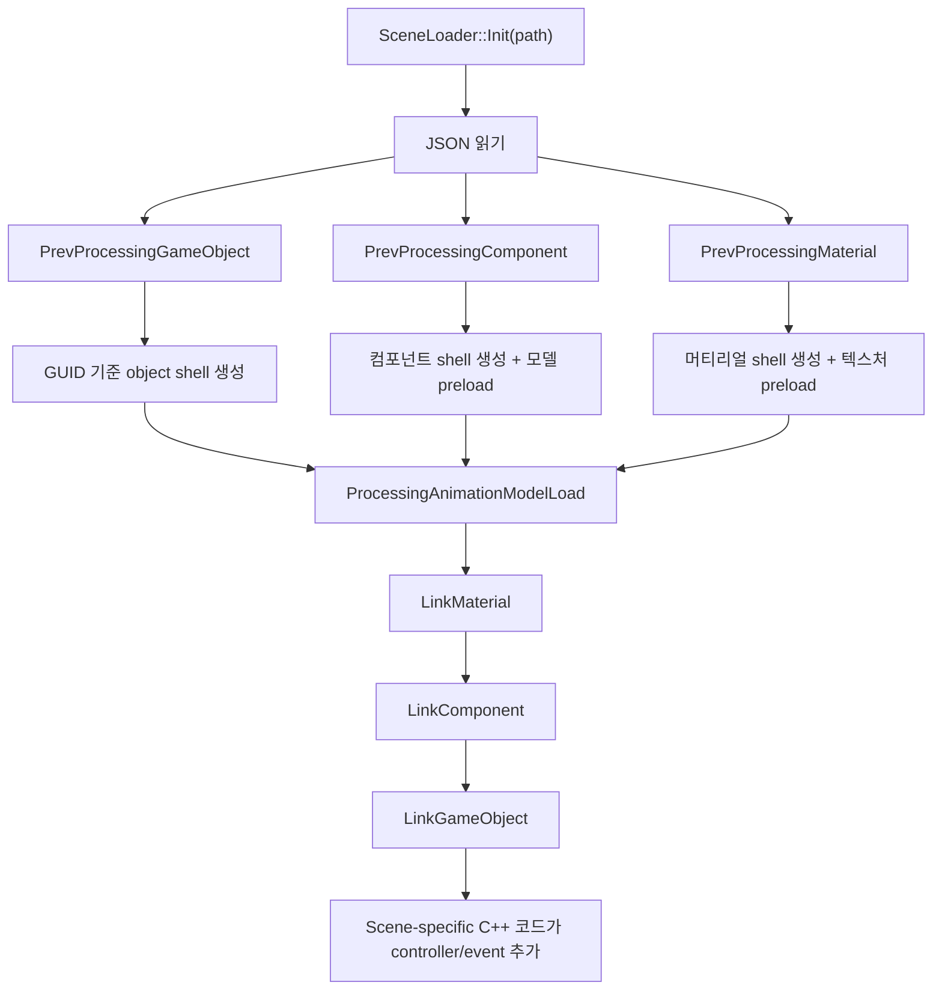

### 5.2 Material / Shader / Buffer / Instancing 관계

실제 draw 직전 바인딩 구조는 다음과 같다.

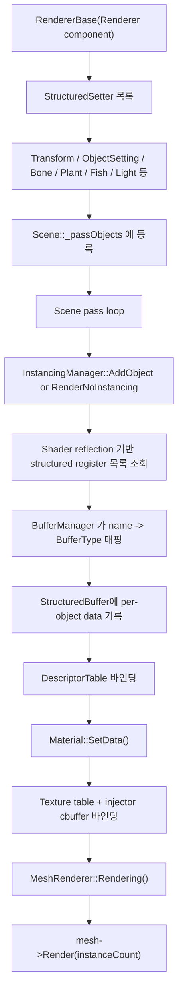

핵심 포인트:

- `Shader::Profile()`로 shader register와 cbuffer 정보를 reflection한다.
- `InstancingManager`는 shader가 요구하는 structured buffer 이름을 보고 setter를 호출한다.
- `Material::SetData()`는 texture descriptor table과 injector cbuffer를 바인딩한다.
- `RendererBase`는 "그리기 로직"보다 "draw 직전 데이터 공급 인터페이스" 역할이 더 크다.

---

## 6. 씬 구조와 전환 흐름

초기 등록되는 씬은 세 개다.

- `SceneType::MainMenu`
- `SceneType::TestScene2` -> 사실상 메인 필드
- `SceneType::Sea01` -> 바다/잠수 씬

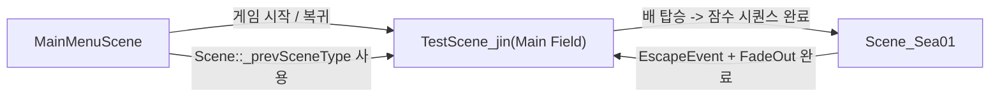

### 씬별 성격

#### MainMenuScene

- 메인 필드용 final shader 사용
- skybox 생성
- `MainMenu.json` 로드
- `ComputeManager::DispatchMainField()` 사용
- `_changeScene`가 켜지면 `_prevSceneType`로 복귀

#### TestScene_jin

- 사실상 마을/메인 필드 허브
- skybox, sea plane, `MainField.json` 로드
- 수동 이벤트 추가
  - 보트 탑승
  - 폭죽 전달 이벤트
  - 금액 UI
- `DispatchMainField()` 사용

#### Scene_Sea01

- 수중 배경과 물면, 전용 directional light 설정
- `Sea.json` 로드
- `seaPlayer`에 `SeaPlayerController` 추가
- `EscapeEvent`로 메인 필드 복귀
- 수중 상호작용/사냥/minigame/UI 구동

---

## 7. 도메인 로직 흐름

## 7.1 메인 필드 플레이어 -> 보트 -> 잠수

`PlayerController`는 메인 필드의 3인칭 캐릭터 제어를 담당한다.

- WASD + Shift 이동
- 마우스 기반 카메라 오빗
- 애니메이션 상태 전환
- 오브젝트 선택 하이라이트
- 보트 탑승 시 자신을 `BoatSeat` 아래로 parent 변경

`BoatController`는:

- 탑승 후 `BoatCamera`를 활성화
- 바다 높이(`WaterController::GetWaveHeight`)에 맞춰 보트 y축 보정
- W로 전진, 마우스로 yaw 회전
- F를 두 번 누르면 잠수 시퀀스 진입

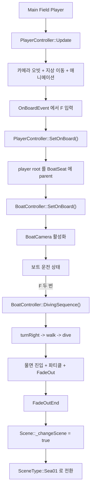

### 관찰 포인트

- 메인 필드 플레이어와 바다 플레이어는 같은 controller를 재사용하지 않는다.
- 전환 시 "같은 캐릭터의 상태를 유지"하기보다 씬별 전용 controller로 역할을 분리했다.

---

## 7.2 바다 플레이어 -> 조준 -> 발사 -> 몬스터 처치 -> 아이템 획득

`SeaPlayerController`는 상태 머신을 가진다.

- `Idle`
- `Aiming`
- `Shot`
- `Die`(현재는 큰 분기 없음)

오른쪽 마우스:

- `Idle <-> Aiming` 토글
- 타겟 HUD on/off

왼쪽 마우스:

- `Aiming -> Shot`
- 화면 중앙 기준 raycast
- 몬스터 hit 시 `FishMonster::EventDamage(10)`
- 총알 object pool에서 발사체 재사용

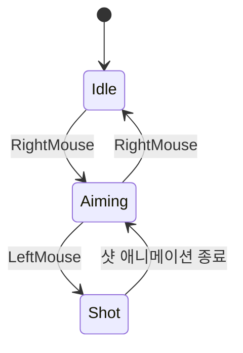

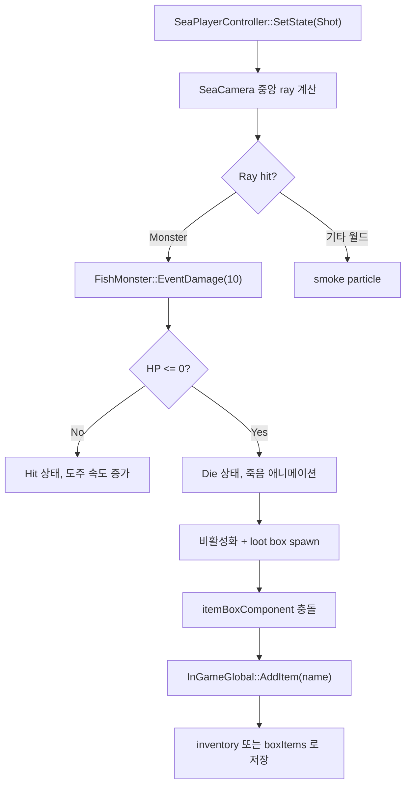

### 몬스터 쪽에서 일어나는 일

- `FishMonster`는 `GraphPathFinder` 또는 `PathFinder`로 이동
- 피격 시 `Hit`
- 사망 시:
  - 죽음 애니메이션
  - 파티클
  - 루트 오브젝트 비활성화
  - `itemBox` 프리팹을 복제해서 드랍 박스 생성

---

## 7.3 인벤토리 / 창고 / 상점 / 레시피

### 상태 저장 위치

UI가 상태를 소유하는 것이 아니라, 실제 데이터는 대부분 `InGameGlobal`에 있다.

- `invItems`
- `boxItems`
- `gold`
- `cookTable`

`GUIInventory`, `GUIItemBox`, `GUIShop`, `GUIRecipe`는 이 데이터를 보여주고 조작하는 뷰 컨트롤러다.

### 인벤토리와 창고

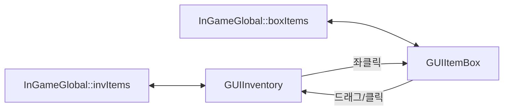

세부 동작:

- `GUIInventory`
  - 숫자키 `1~5`로 선택 슬롯 갱신
  - 선택된 아이템을 `GUIItemBox`로 보낼 수 있음
- `GUIItemBox`
  - 열고 닫기 가능
  - 클릭으로 인벤토리 복귀
  - 슬롯 간 swap 가능

### 상점과 레시피

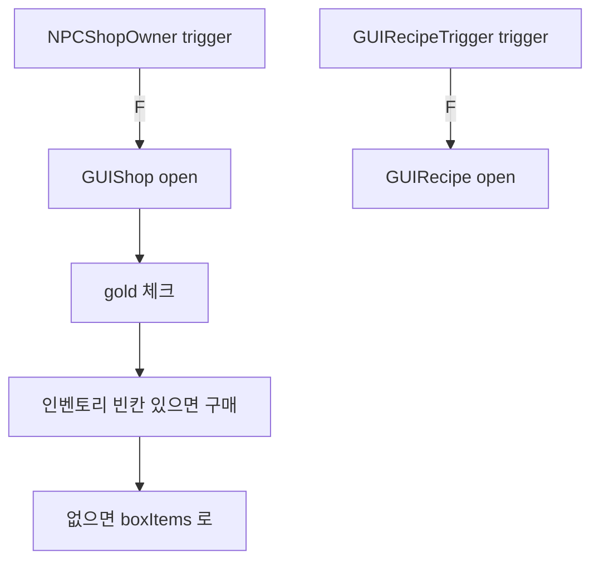

상점 판매 아이템은 코드상 고정값이다.

- `ItemData(7, -1)`
- `ItemData(12, -1)`

즉 현재 shop은 완전한 데이터 주도형이 아니라, 하드코딩된 상품 목록을 가진다.

---

## 7.4 단일 조리 스테이션 흐름

`CookObject`는 한 번에 한 아이템을 받아 가공하는 스테이션이다.

지원 태그:

- `CookType_Cut`
- `CookType_Bake`
- `CookType_Wash`
- `CookType_Boil`

진행 방식:

1. 플레이어가 trigger 안에 들어옴
2. `F`를 눌러 선택 인벤토리 아이템을 스테이션에 투입
3. `GUICookProgress` 진행
4. 성공 후 다시 `F`를 눌러 결과물 회수
5. 결과물은 인벤토리 또는 박스로 반환

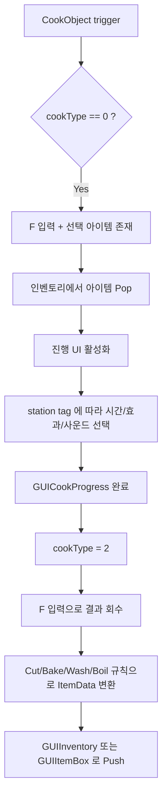

가공 규칙은 코드에 직접 들어 있다.

- `Cut`
  - 생선을 손질해서 고기 재료로 바꾸거나, 기본적으로 `itemCookType = 2`
- `Bake`
  - `itemCookType = 0`
- `Wash`
  - `itemCookType = 1`
- `Boil`
  - `itemCookType = 3`
  - 특정 조합은 실패하거나 다른 재료로 변형됨

---

## 7.5 레시피 조합 스테이션 흐름

`CookMargeObject`는 여러 재료를 슬롯에 넣고 레시피를 매칭하는 합성 스테이션이다.

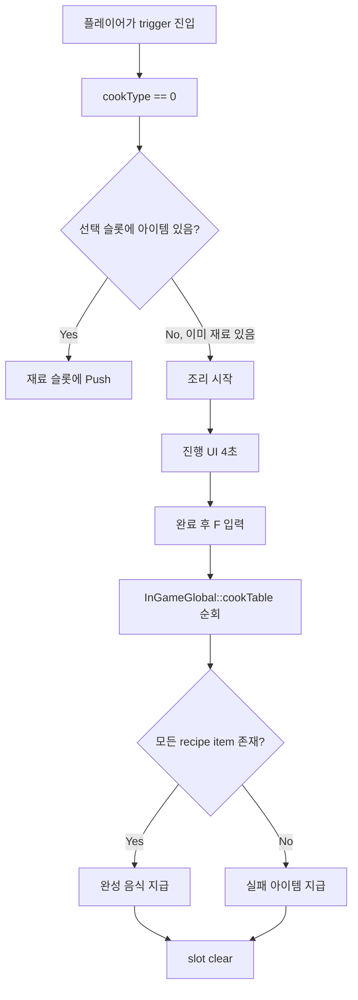

현재 코드 기준 완성 음식은:

- `ItemData(10, -1)` 계열
- `ItemData(11, -1)` 계열

실패 시:

- `ItemData(9, 2)` 지급

즉, 레시피 검증은 "재료 목록이 모두 포함되어 있는지"로 처리되고, 개별 슬롯 순서는 중요하지 않다.

---

## 7.6 NPC 식당 FSM

NPC는 `StatePattern` 기반 FSM으로 움직인다.

상태:

- `goto_any`
- `idle`
- `goto_shop`
- `goto_table`
- `eat`

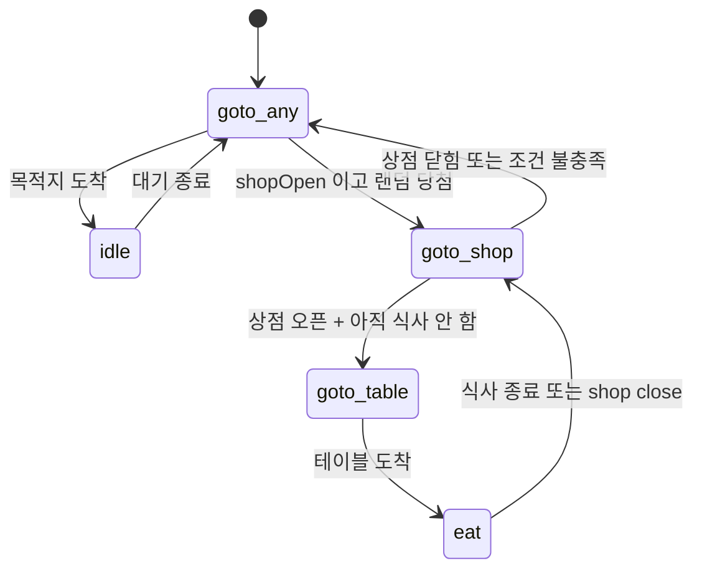

실제 식당 로직은 다음과 같다.

1. `InGameMainField::shopOpen`이 true가 되면 일부 NPC가 식당으로 감
2. entry point까지 navmesh path 이동
3. 남는 table point 하나를 pool에서 꺼내 앉으러 감
4. `GUINPCFood` UI가 뜨고, 원하는 음식(`10` 또는 `11`)를 랜덤으로 요구
5. 플레이어가 해당 음식을 들고 가까이 가서 `F`
6. NPC가 eat 애니메이션
7. 식사 완료 시 `gold += 5`
8. table point는 pool로 반환

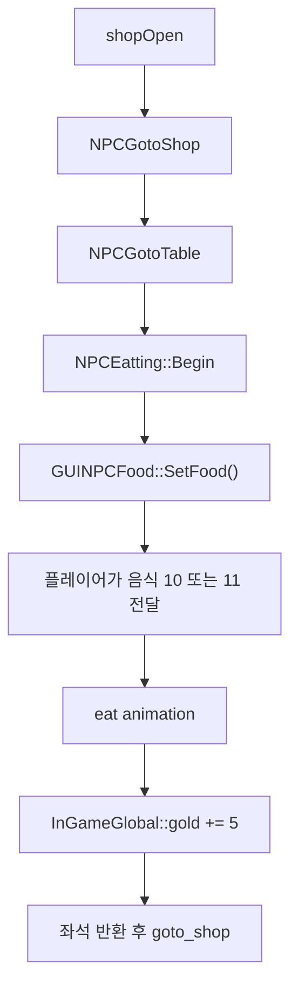

이 시스템은 "NPC 행동", "UI 요구", "플레이어 인벤토리", "경제 보상"이 하나의 루프로 연결된 메인 필드 핵심 루프다.

---

## 8. 코드에서 확인되는 최적화 테크닉

아래는 실제 코드로 확인되는 것만 정리했다.

### 8.1 프러스텀 컬링

- `Scene::ForwardPass`, `DeferredPass`, `TransparentPass`, `TransparentAfterPPPass`, `ShadowPass`
- `Camera::IsInFrustum(BoundingBox&)`
- 각 렌더러의 `_bound` 사용

효과:

- 카메라에 안 보이는 오브젝트를 CPU 단계에서 컷
- 디버그 카운터(`g_debug_*_culling_count`)로 확인 가능

### 8.2 인스턴싱 배칭

- `RendererBase::_isInstancing`
- `Scene` 패스 루프에서 instancing 대상은 `InstancingManager::AddObject()`
- key는 `meshID + materialID`
- 같은 메시/머티리얼 묶음을 한 번에 draw

효과:

- draw call 감소
- structured buffer offset 기반 per-instance data 공급

### 8.3 Deferred + GBuffer 4장

- Position / Normal / Color / MAO 분리
- lighting/post effect 입력을 공통화

효과:

- SSAO, underwater, fog 같은 screen-space effect 구성 쉬움
- 최종 합성 이전에 필요한 버퍼를 명확히 유지

### 8.4 캐스케이드 섀도우맵

- `ShadowBuffer` 4장
- 씬별 분할 거리 다름
- split마다 별도 light VP 사용

효과:

- 근거리 품질 유지
- 원거리까지 그림자 확장

### 8.5 Post-process ping-pong

- `_pingTexture`, `_pongTexture`
- blur, bloom, DOF, SSAO, underwater 등에서 UAV/SRV를 번갈아 사용

효과:

- 중간 RT를 재활용
- compute chain 구성 단순화

### 8.6 Descriptor / Buffer pool

- `BufferManager`가 frame-context별 cbuffer/structured buffer/table 관리
- `Reset()` 시 현재 context의 allocator만 리셋

효과:

- 프레임마다 작은 버퍼를 많이 만드는 패턴을 단순화
- per-frame transient resource 관리 용이

### 8.7 오브젝트 풀링

- `Weapon::_bulletQueue`
- 총알 50개를 미리 만들어 비활성화 후 재사용

효과:

- 발사 시 런타임 allocation 감소
- 수중 슈팅 루프 안정화

### 8.8 Terrain 전용 컬링/인스턴싱

- `TerrainManager::CullingInstancing(cameraPos, look)`
- shadow pass와 deferred pass에서 모두 호출

효과:

- 풀/식생/terrain detail 류 오브젝트를 시점 기반으로 줄임

### 8.9 JSON 씬 로드 + 런타임 수동 추가

- 정적 배치는 `SceneLoader`
- 동적 로직은 씬별 C++에서 후처리

효과:

- 씬 데이터와 행동 코드를 분리
- Unity export된 배치를 재사용하면서 게임 로직은 C++에서 유지

```mermaid
flowchart TD
    A["CPU 최적화"] --> B["Frustum culling"]
    A --> C["Terrain culling/instancing"]
    A --> D["Draw batching"]

    E["GPU 최적화"] --> F["Deferred GBuffer"]
    E --> G["4-split shadow map"]
    E --> H["Ping-Pong compute"]

    I["메모리/수명주기"] --> J["Buffer/Descriptor pool"]
    I --> K["Bullet object pool"]

    L["콘텐츠 파이프라인"] --> M["JSON SceneLoader"]
    L --> N["Scene-specific runtime add-on"]
```

---

## 9. 읽으면서 정리된 구조적 해석

### 9.1 이 프로젝트의 진짜 중심은 `Scene`

`Scene`이 맡는 역할이 아주 많다.

- 오브젝트 스케줄러
- 렌더 패스 그래프 실행기
- 전역 GPU 데이터 바인딩 지점
- destroy queue 정리 지점
- 씬 전환 시그널 소비 지점

즉 ECS도 아니고 전통적인 엔진 루프도 아니며, "씬 오브젝트 그래프 + 패스 드라이버"가 결합된 형태다.

### 9.2 메인 필드와 바다는 "같은 게임"이지만 사실상 다른 렌더/도메인 모드다

- 메인 필드
  - 3인칭 지상 이동
  - 상점/조리/NPC 경제 루프
  - bloom/fxaa/dof/vignette 중심
- 바다
  - 자유 수영 + 조준/사격
  - 수중 상호작용 미니게임
  - underwater/scattering 중심

그래서 `Scene_Sea01`이 렌더 순서를 override 하고, controller도 `PlayerController`와 `SeaPlayerController`를 분리해 둔 것이 자연스럽다.

### 9.3 데이터 주도와 하드코딩이 섞여 있다

데이터 주도:

- 씬 배치
- 모델/머티리얼/콜라이더/애니메이션 키
- terrain/navmesh

하드코딩:

- 상점 판매 목록
- 조리 규칙
- 레시피 조합
- 이벤트 트리거 콜백
- 씬 전환 타이밍

즉 현재 구조는 "배치 데이터는 외부화, 게임 규칙은 코드화" 모델이다.

---

## 10. 한 줄 요약

`CatchAndCook`의 런타임은 `Game`이 프레임을 스케줄하고, `Scene`이 로직과 렌더 패스를 통합 관리하며, `RendererBase + Material + InstancingManager + ComputeManager`가 실제 GPU 파이프라인을 완성하는 구조다. 그 위에 메인 필드의 경제/조리 루프와 바다 씬의 수중 사냥 루프가 씬 전환으로 이어지며, `SceneLoader`가 정적 콘텐츠를 복원하고 각 씬 C++ 코드가 실제 플레이 규칙을 붙인다.
